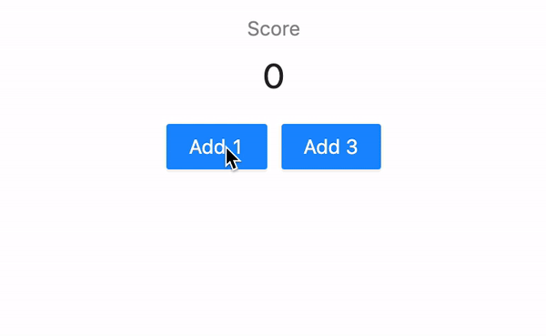

# Context
## Instructions
create a React app that will have a `<Scoreboard />` and two `<AddPoint />` components.

the `<Scoreboard />` component will show the score and the first `<AddPoint />` will have a button to add 1 point and other will add 3 points to the score.

to share state between component make sure to use [context api](https://reactjs.org/docs/context.html)
## Reference
- https://reactjs.org/docs/hooks-reference.html#usecontext
- https://reactjs.org/docs/context.html

## Your app should look like this:

