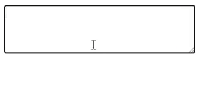

# Side Effects
## Instructions

Create a component that will have a `<textarea>` and get its initial value from `localStorage` (if available) and keep the `localStorage` update when the value is changed.

## Your app should look like this:

## Reference
- https://reactjs.org/docs/hooks-effect.html
- https://developer.mozilla.org/en-US/docs/Web/API/Window/localStorage
