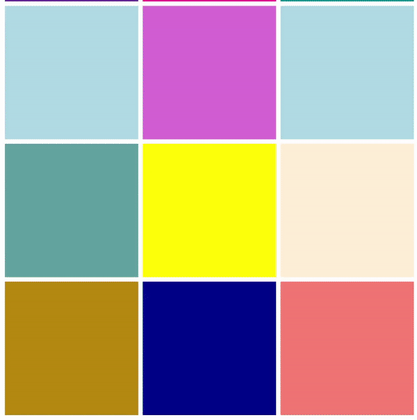

# State
## Instructions
create a stateful component `<ColorBox />` that has `
` box with a square shape, `gray` color and changes to a random color every time you click inside the `
`

Render your component 30 times.

## Your app should look like this:

## References
- https://reactjs.org/docs/hooks-overview.html
- https://reactjs.org/docs/hooks-state.html